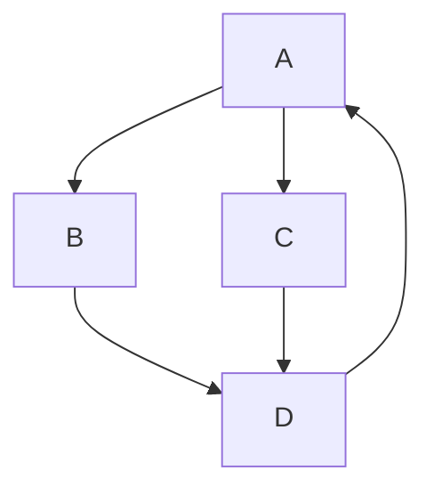

# Obsidian-Cheat-Sheet

## Internal File Linking

In Obsidian we can link files inside the computer file system to notes. This is useful when using programs like Matlab or Solidworks or applications that are needed for specific applications. 

The general structure: 

```
[Displayed Name](file:///****Destination Address Starts with C:*********)
```

If the address has a space lets say `/Obsidian Vault/` The address will stop at `Obsidian` to fix this replace with a `%20` the pixies will get recognized as a space and the address will get recognized till the end of the address. Should look like `/Obsidian%20Vault/`. 

---
## Linking within document

[my text](#call-out-boxes)


## Mermaid Charts (Gantt Charts are broken, don't even bother.)
[Mermaid Diagrams](https://mermaid-js.github.io/mermaid/#/)

A complete ref of how these work is in the link above. Because Mermaid is in active dev its best to refer to the website for up-to-date info, below is an example of a flow chart.


---
## Call Out Boxes
[Call Outs](https://help.obsidian.md/Editing+and+formatting/Callouts)

These boxes can be used to add flare to your notes, there are multiple different colors and symbols. Markdown natively doesn't render, they look fantastic in obsidian though. 

---
## Visual note-taking

//todo add images  
Useful for taking notes, most notably in video games (so far)  
Use these settings for the nodes for best results (image here)  
See Persistent graph plugin for saving graph for visual notes.

---
## Useful settings

- VIM editing: Editor -> Advanced

---
## Community Plug-ins

1. Calender by Lian Cain
2. Highlightr by chetachi (He/she "no idea" has an interesting way of scrolling through the colors that's actually innovative "i like it alot")
3. Image Toolkit by sissilab
4. Obsidian CircuitJS by Steven Gann
5. Obsidian matrix by Jonas Mohr
6. Meld Encrypt by meld-cp
7. [Persistent graph](https://publish.obsidian.md/hub/02+-+Community+Expansions/02.05+All+Community+Expansions/Plugins/persistent-graph) by Sanqui

---